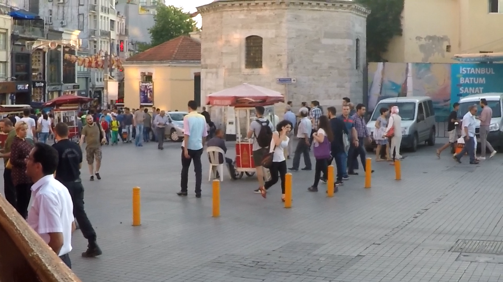
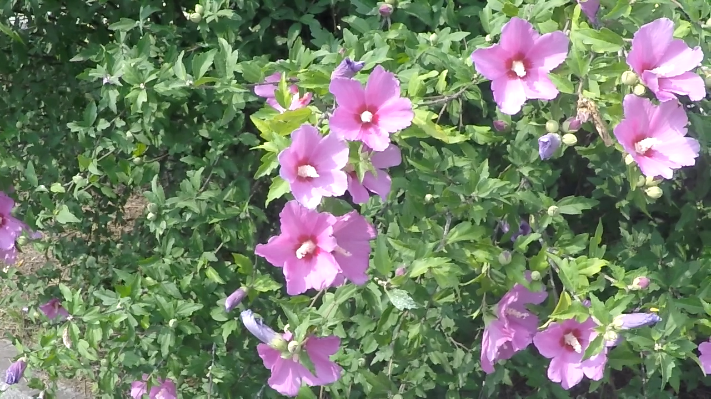

# DeepDeblur_release

Single image deblurring with deep learning.

This is a project page for our research.
Please refer to our CVPR 2017 paper for details:

Deep Multi-scale Convolutional Neural Network for Dynamic Scene Deblurring
[[paper](http://openaccess.thecvf.com/content_cvpr_2017/papers/Nah_Deep_Multi-Scale_Convolutional_CVPR_2017_paper.pdf)]
[[supplementary](http://openaccess.thecvf.com/content_cvpr_2017/supplemental/Nah_Deep_Multi-Scale_Convolutional_2017_CVPR_supplemental.zip)]
[[slide](https://drive.google.com/file/d/1sj7l2tGgJR-8wTyauvnSDGpiokjOzX_C/view?usp=sharing)]
<!-- [[slide](https://cv.snu.ac.kr/~snah/Deblur/CVPR2017_DeepDeblur_release.pptx)] -->

If you find our work useful in your research or publication, please cite our work:
```
@InProceedings{Nah_2017_CVPR,
  author = {Nah, Seungjun and Kim, Tae Hyun and Lee, Kyoung Mu},
  title = {Deep Multi-Scale Convolutional Neural Network for Dynamic Scene Deblurring},
  booktitle = {The IEEE Conference on Computer Vision and Pattern Recognition (CVPR)},
  month = {July},
  year = {2017}
}
```

## New dataset released!

Check out our new **[REDS](https://seungjunnah.github.io/Datasets/reds)** dataset!
In CVPR 2019, I am co-organized the [4th NTIRE workshop](http://www.vision.ee.ethz.ch/ntire19/) and the according video restoration challenges. 
We released the **REDS** dataset for challenge participants to train and evaluate video deblurring / super-resolution algorithms.
Special thanks go to my colleagues, [Sungyong Baik](https://scholar.google.com/citations?user=lQ4gotkAAAAJ&hl=en), [Seokil Hong](https://scholar.google.com/citations?user=nYDLTksAAAAJ&hl=en), [Gyeongsik Moon](https://scholar.google.com/citations?user=2f2D258AAAAJ&hl=en), [Sanghyun Son](https://scholar.google.com/citations?user=nWaSdu0AAAAJ&hl=en), [Radu Timofte](https://scholar.google.com/citations?user=u3MwH5kAAAAJ&hl=en) and [Kyoung Mu Lee](https://scholar.google.com/citations?user=Hofj9kAAAAAJ&hl=en) for collecting, processing, and releasing the dataset together.

### Updates
Downloads are now available for training, validation, and test input data. Public leaderboard site is under construction.
Download page: [https://seungjunnah.github.io/Datasets/reds](https://seungjunnah.github.io/Datasets/reds)

[](http://www.vision.ee.ethz.ch/ntire19/)

## Dependencies
* [torch7](http://torch.ch/docs/getting-started.html#_)
* [torchx](https://github.com/nicholas-leonard/torchx)
```bash
  luarocks install torchx
```
* cudnn
```bash
    cd ~/torch/extra/cudnn
    git checkout R7 # R7 is for cudnn v7
    luarocks make
```

## Code

To run demo, download and extract the trained models into "experiment" folder.

<!-- * [models](http://cv.snu.ac.kr/~snah/Deblur/DeepDeblur_models/experiment.zip) -->
* [models](https://drive.google.com/file/d/1Z8dV6KuubfOKj4ganEjxymhyMoXoydfo/view?usp=sharing)

Type following command in "code" folder.
```bash
qlua -i demo.lua -load -save release_scale3_adv_gamma -blur_type gamma2.2 -type cudaHalf
qlua -i demo.lua -load -save release_scale3_adv_lin -blur_type linear -type cudaHalf
```

To train a model, clone this repository and download below dataset in "dataset" directory.

The data structure should look like 
"dataset/GOPRO_Large/train/GOPRxxxx_xx_xx/blur/xxxxxx.png"

Then run main.lua in "code" directory with optional parameters.
```bash
th main.lua -nEpochs 450 -save scale3 # Train for 450 epochs, save in 'experiment/scale3'
th main.lua -load -save scale3  # Load saved model
> blur_dir, output_dir = ...
> deblur_dir(blur_dir, output_dir)
```
Optional parameters are listed in opts.lua

ex) -type: Operation type option. Supports cuda and cudaHalf. Half precision CNN has similar accuracy as single precision in evaluation mode. However, fp16 training is not meant to be supported in this code. ADAM optimizer is hard to use with fp16.

## Dataset

In this work, we proposed a new dataset of realistic blurry and sharp image pairs using a high-speed camera.
However, we do not provide blur kernels as they are unknown.

Statistics | Training | Test | Total 
-- | -- | -- | --
sequences | 22 | 11 | 33
image pairs | 2103 | 1111 | 3214


__*Download links*__ 

<!-- * [GOPRO_Large](http://cv.snu.ac.kr/~snah/Deblur/dataset/GOPRO_Large.zip) -->
* [GOPRO_Large](https://drive.google.com/file/d/1H0PIXvJH4c40pk7ou6nAwoxuR4Qh_Sa2/view?usp=sharing)
: Blurry and sharp image pairs. Blurry images includes both gamma corrected and not corrected (linear CRF) versions.

<!-- * [GOPRO_Large_all](http://cv.snu.ac.kr/~snah/Deblur/dataset/GOPRO_Large_all.zip) -->
* [GOPRO_Large_all](https://drive.google.com/file/d/1SlURvdQsokgsoyTosAaELc4zRjQz9T2U/view?usp=sharing)
: All the sharp images used to generate blurry images. You can generate new blurry images by accumulating differing number of sharp frames.

[//]: # " * [GOPRO_Large_raw](http://cv.snu.ac.kr/~snah/Deblur/dataset/GOPRO_Large_raw.zip)"

Here are some examples.

Blurry image example 1


Sharp image example 1


Blurry image example 2


Sharp image example 2



## Acknowledgement

This project is partially funded by Microsoft Research Asia
